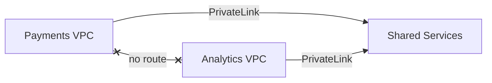

<h2 align="center">Mohamed Yusuf</h2>

<b>Cloud Engineer</b> · Minneapolis, MN I design AWS infrastructure, build it as code, and break it on purpose to prove it holds.

  

  
  
  
  
  
  

---

### What I work on

Software Engineer at World Racing Group, where I work with AWS (S3, IAM, Lightsail, CloudFormation) and GitHub Actions CI/CD. Outside of work I build production-style AWS architectures, write up every design decision, and document what broke along the way.

### Featured project

**[aws-privatelink-multi-vpc-terraform](https://github.com/MoYusuf1/aws-privatelink-multi-vpc-terraform)**
Three isolated VPCs share one internal service over PrivateLink, with no peering and no public IPs. Access approvals live in code, the service identifies which team is calling, and every change runs through mocked tests, tflint, and Checkov in CI.

### Architecture write-ups

| Project | What it proves |
|---|---|
| [Private multi-VPC with PrivateLink](https://www.linkedin.com/pulse/how-i-built-private-multi-vpc-architecture-aws-mohamed-yusuf-xjnoc/) | Sharing one service between teams without connecting their networks |
| [Rebuilt in Terraform](https://www.linkedin.com/pulse/how-i-rebuilt-private-multi-vpc-architecture-so-team-could-yusuf-c21mf/) | Access decisions reviewed in code, tested before they reach AWS |
| [Multi-region with Global Accelerator](https://www.linkedin.com/in/mohamed-yusuf1/recent-activity/articles/) | Surviving a regional outage, verified by taking the primary down |
| [Event-driven order processing](https://www.linkedin.com/in/mohamed-yusuf1/recent-activity/articles/) | Retries, dead-letter queues, and no lost orders when a worker fails |
| [Zero-downtime deployments](https://www.linkedin.com/in/mohamed-yusuf1/recent-activity/articles/) | Blue-green cutover and one-step rollback behind a load balancer |
| [Private S3 and CloudFront hosting](https://www.linkedin.com/in/mohamed-yusuf1/recent-activity/articles/) | Tracing a misleading 403 across CloudFront and S3 |

### Currently

Migrating [LeetGrammar](https://github.com/MoYusuf1/LeetGrammar) from Vercel to AWS with Terraform.

  

