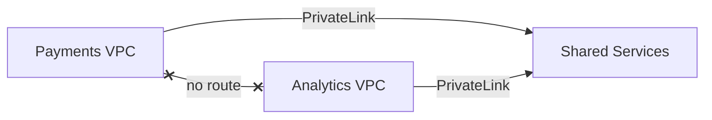

I build private, auditable AWS infrastructure in Terraform, and write up every design decision along the way.

**6 AWS architectures. Every one documented, including what broke.**

| Build | What broke |
|---|---|
| [PrivateLink in Terraform](https://www.linkedin.com/pulse/how-i-rebuilt-private-multi-vpc-architecture-so-team-could-yusuf-c21mf/) | CI failed before any test ran because the mock values were not valid ARNs |
| [Private multi-VPC with PrivateLink](https://www.linkedin.com/pulse/how-i-built-private-multi-vpc-architecture-aws-mohamed-yusuf-xjnoc/) | The service could not tell which team was calling until Proxy Protocol v2 |
| [Multi-region with Global Accelerator](https://www.linkedin.com/in/mohamed-yusuf1/recent-activity/articles/) | The load balancer looked down because I was calling HTTPS on an HTTP-only listener |
| [Event-driven order processing](https://www.linkedin.com/in/mohamed-yusuf1/recent-activity/articles/) | Orders stuck in pending because the stream processor mixed CommonJS into an ES module |
| [Zero-downtime deployments](https://www.linkedin.com/in/mohamed-yusuf1/recent-activity/articles/) | Every target unhealthy because invalid characters broke the startup script |
| [Private S3 and CloudFront hosting](https://www.linkedin.com/in/mohamed-yusuf1/recent-activity/articles/) | A 403 that was really a blank Default Root Object |

**Featured** &nbsp; [aws-privatelink-multi-vpc-terraform](https://github.com/MoYusuf1/aws-privatelink-multi-vpc-terraform) 
Three isolated VPCs sharing one service over PrivateLink, with approvals in code and tests in CI.

**Connect** &nbsp; [LinkedIn](https://www.linkedin.com/in/mohamed-yusuf1/)
